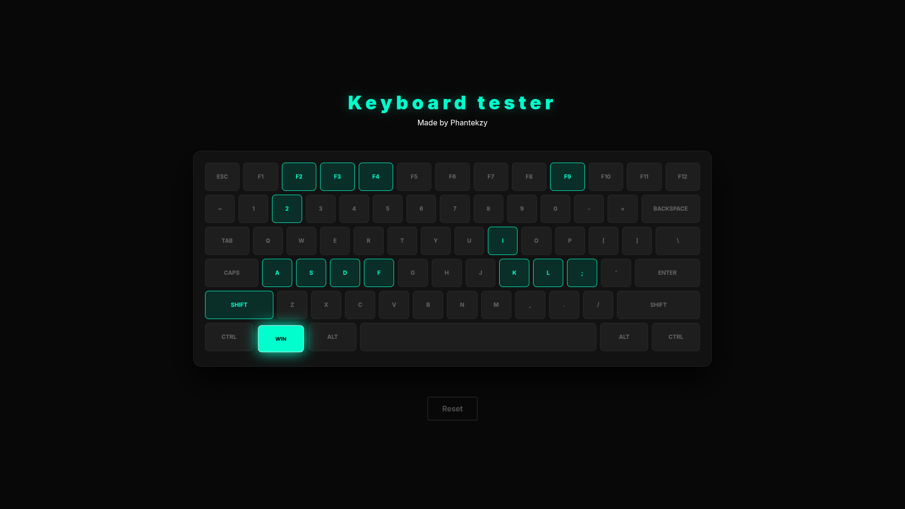

# Keys

## Overview

Keys is a responsive, web-based diagnostic utility designed to test the functionality and latency of mechanical keyboard switches. Built with modern React and TypeScript, it provides real-time visual feedback for keystrokes, accurately maps standard keyboard geometry, and overrides default browser shortcuts to ensure comprehensive testing capabilities.

## Features

* Real-Time State Tracking: Accurately tracks and visualizes key states (idle, pressed, tested) with zero perceivable latency.
* Accurate Layout Mapping: Utilizes CSS Flexbox to render accurate proportional widths for specialized keys (e.g., Spacebar, Shift, Enter).
* Event Override: Safely intercepts default browser shortcuts (such as F5 or Ctrl+P) to allow full-board diagnostic testing without interrupting the user session.
* Memory Management: Implements clean unmounting and event listener cleanup to prevent memory leaks during extended testing sessions.
* Type-Safe Architecture: Fully typed with TypeScript, utilizing custom interfaces and unions for predictable state management.

## Tech Stack

* Framework: React 18
* Language: TypeScript
* Styling: Standard CSS (with Glassmorphism UI elements)
* State Management: React Hooks (useState, useEffect, useCallback)

## Getting Started

### Prerequisites

* Node.js (v16.0.0 or higher)
* npm or yarn

### Installation

1. Clone the repository:
   git clone https://github.com/phantekzy/Keys.git

2. Navigate into the directory:
   cd Keys

3. Install the dependencies:
   npm install

4. Start the development server:
   npm start

The application will be available at http://localhost:3000.

## Project Structure

* `/src/constants/layout.ts`: Contains the 2D array mapping of the physical keyboard layout and key proportions.
* `/src/types/keyboard.ts`: Defines TypeScript interfaces (`KeyConfig`) and state unions (`KeyStatus`).
* `/src/hooks/useKeyboard.ts`: Custom hook managing the core logic, event listeners, and state updates.
* `/src/components/Key.tsx`: The atomic presentation component for individual keycaps.
* `/src/components/Keyboard.tsx`: The manager component that maps the layout data to the UI.

## Contributors

* Phantekzy - Lead Developer
* Ferchouch (My cat) - Co-Author / Thanks for not peing on my laptop

## License

This project is licensed under the MIT License.
